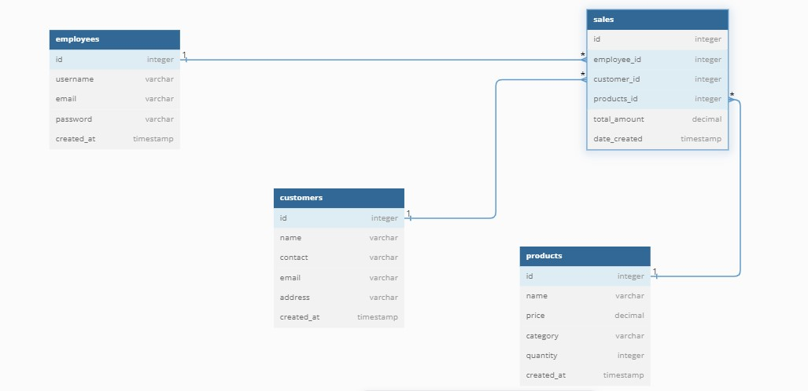

---

# Proyecto: Registro de Ventas de Empleados

Este proyecto tiene como objetivo crear una aplicación donde los empleados de un comercio de suministros de limpieza puedan registrar sus ventas de manera individual y acceder a la aplicación utilizando credenciales.

## Estructura del proyecto

El proyecto está basado en **Mongoose**, una biblioteca de modelado de datos para MongoDB y Node.js. A continuación, se describe cómo se han modelado las colecciones y sus relaciones.

### Diagrama de relaciones en Mongoose

El sistema cuenta con cinco colecciones principales:
1. **Employers**: Representa a cada empleado que utiliza la aplicación. Incluye información como su nombre, email y credenciales de acceso.
2. **Customers**: Representa a los clientes que realizan compras. Incluye información relevante como su nombre y contacto.
3. **Products**: Contiene la información sobre los productos disponibles para la venta, incluyendo nombre, precio, categoría y cantidad.
4. **Sales**: Contiene el registro de cada venta realizada por los empleados. Incluye detalles como el empleado que realizó la venta, el cliente, los productos vendidos, la cantidad, el precio unitario, el total y la fecha de la venta.

### Relaciones entre las colecciones

1. **Relación Empleado-Ventas**: 
   - Tipo de relación: **Referencial**.
   - Justificación: Las ventas se referencian a los empleados para mantener un diseño escalable. Un empleado puede realizar múltiples ventas, y hacer una referencia permite que el documento del empleado no crezca innecesariamente.

2. **Relación Cliente-Ventas**: 
   - Tipo de relación: **Referencial**.
   - Justificación: Similar a la relación anterior, las ventas se referencian a los clientes para gestionar la información de forma independiente sin afectar las colecciones de ventas.

3. **Relación Producto-Ventas**: 
   - Tipo de relación: **Referencial**.
   - Justificación: La relación entre productos y ventas se maneja mediante referencias, permitiendo que un producto sea asociado a múltiples ventas sin duplicar datos.

   

### Modelo de Empleado

- **username**: Nombre del empleado. Es un campo requerido que permite identificar al empleado en el sistema.
- **email**: Dirección de correo electrónico del empleado. Este campo es único y se utiliza para la autenticación.
- **password**: Contraseña del empleado para acceder al sistema.
- **sales**: Array que almacena las referencias a las ventas realizadas por el empleado, permitiendo asociar múltiples registros de ventas a un solo empleado.

### Modelo de Cliente

- **name**: Nombre del cliente. Campo requerido para identificar al cliente.
- **contact**: Información de contacto del cliente, necesaria para futuras comunicaciones.
- **email**: Dirección de correo electrónico del cliente. Este campo es único y permite la identificación.
- **address**: Dirección física del cliente, importante para el envío de productos si es necesario.

### Modelo de Producto

- **name**: Nombre del producto. Campo requerido para identificar el producto en el inventario.
- **price**: Precio del producto. Es un campo requerido que permite calcular el total de ventas.
- **category**: Categoría a la que pertenece el producto. Este campo facilita la organización del inventario.
- **quantity**: Cantidad disponible del producto en el inventario, esencial para gestionar la disponibilidad.

### Modelo de Venta

- **employee**: Referencia al empleado que realizó la venta, permitiendo vincular la venta con el vendedor correspondiente.
- **customer**: Referencia al cliente que realizó la compra, necesaria para mantener un registro de quién compró.
- **products**: Array que almacena los productos vendidos, incluyendo referencias a los mismos, la cantidad vendida y el precio unitario.
- **totalAmount**: Monto total de la venta, calculado en base a la cantidad y el precio unitario de los productos vendidos.
- **dateCreated**: Fecha en que se realizó la venta, para llevar un registro temporal de las transacciones.

### Instalación y configuración

1. Clona el repositorio.
2. Instala las dependencias necesarias ejecutando:
   ```bash
   npm install
   ```
3. Ejecuta el proyecto:
   ```bash
   npm start
   ```